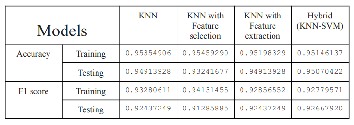

# HeartStrokePredictionsWithHybridAlgorithm

*Methodology*
  - Using Python for data cleaning and preprocessing
  - EDA
  - Proform model learning using algorithms below :
     i. KNN
    ii. KNN after Feature selection
   iii. KNN after Feature Exteraction
  - Evaluate each step and test them
  - Prefrom Model learing by combining both KNN-SVM algorithm for better accuracy
  - compare the models for each step

    
*The result for the data*

 

